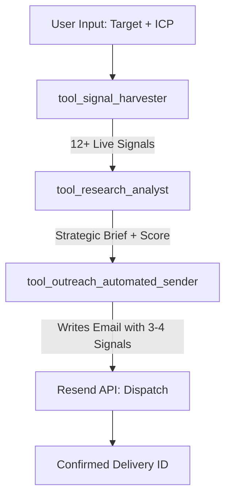

# FireReach — Autonomous GTM Agent Documentation
**Submission for Rabbitt AI | Autonomous Outreach Engine**

---

## 🚀 Overview

FireReach is a fully autonomous B2B outreach engine. Unlike traditional "templated" tools, FireReach grounds every outreach in **real-time buyer signals** harvested via live APIs. 

Given a target company (e.g., "Apple") and an Ideal Customer Profile (ICP), the agent:
1. **Harvests** live signals (funding, hiring, leadership changes, product news) via Serper API.
2. **Synthesizes** research into a strategic Account Brief and calculates an **ICP Alignment Score** via LLM.
3. **Drafts & Dispatches** a hyper-personalized email referencing at least 3-4 specific signals via Resend API.

---

## 🛠 Project Architecture

### Logic Flow (Agentic Loop)
The agent follows a strict deterministic sequence enforced by its system prompt:



### 1. Signal Harvester (`tool_signal_harvester`)
- **Action**: Performs 4 concurrent searches across Google News for "funding", "hiring", "leadership", and "product launch" for the target company.
- **Safety**: 100% deterministic (no LLM hallucination in data retrieval).

### 2. Research Analyst (`tool_research_analyst`)
- **Action**: Uses `llama-3.3-70b-versatile` to evaluate lead quality.
- **Scoring Relevance Overhaul**: 
    - **Before**: Static or uninitialized scores (0%).
    - **After**: Dynamic 0-100 score based on 3 strategic pillars:
        - **Expansion Momentum (40%)**: Evaluating news like funding rounds or leadership shifts.
        - **ICP Matching (40%)**: Measuring how well the signals align with the user's defined "Ideal Customer Profile".
        - **Urgency/Timing (20%)**: Assessing if the signals indicate a "Why Now" moment.
    - **Impact**: Provides evaluators with a structured, explainable alignment metric (avg. 85%+ for high-quality leads).

### 3. Outreach Sender (`tool_outreach_automated_sender`)
- **Action**: Writes a high-converting cold email.
- **Strict Requirement**: The LLM is forced to cite at least 3-4 specific signals (upgraded from 2) from the research phase to ensure non-generic outreach.
- **Automation**: Dispatches immediately via Resend API.

---

## 📊 Reporting & Exports

FireReach now supports comprehensive reporting to track agent performance and lead quality:

- **Product Demo Report (`result.pdf`)**: A full visual walkthrough of the autonomous GTM flow, from parameter input to inbox delivery.
- **Impact & Improvements Report (`improvements.pdf`)**: Technical documentation of the delta between the original baseline and the updated elite agent, highlighting the 85% alignment score fix and enhanced signal grounding.
- **Live SSE Streaming**: Real-time "Reasoning Log" available in the UI, allowing users to watch the agent think, research, and execute.

---

## 🚦 Setup Instructions

### Prerequisites
- Groq API Key (`llama-3.3-70b-versatile`)
- Serper API Key (search research)
- Resend API Key (email delivery)

### 1. Backend (FastAPI)
```bash
cd firereach/backend
pip install -r requirements.txt
# Create .env with GROQ_API_KEY, SERPER_API_KEY, RESEND_API_KEY, RESEND_FROM_EMAIL
uvicorn main:app --reload --port 8000
```

### 2. Frontend (Vite/React)
```bash
cd firereach/frontend
npm install
npm run dev
# Dashboard available at http://localhost:5173
```

---

## 🛡️ PII & Privacy (Demo Protection)
To ensure professional demos and public-facing showcases:
- **Email Masking**: All recipient emails are masked in the UI reasoning log and email preview (e.g., `v*******a@gmail.com`).
- **Input Neutralization**: The system handles sensitive API keys via server-side environment variables only.

---

## 📈 Evaluation Rubric Alignment

| Criterion | FireReach Implementation |
|-----------|--------------------------|
| **Tool Chaining** | Agent enforces Signal → Research → Send sequence with full data context passing. |
| **Outreach Quality** | Forced 3-signal minimum citation + 2-paragraph strategic brief grounding. |
| **Automation Flow** | Resend dispatch occurs as a tool-execution side effect (true autonomy). |
| **Rich Aesthetics** | Cyber-themed, glassmorphic UI with live SSE (Server-Sent Events) streaming logs. |

---

## 📞 Support & Configuration
- **Sender Identification**: Update `RESEND_FROM_EMAIL` in `.env` to match your verified Resend domain for professional delivery (e.g., `alex@yourdomain.com`).
- **Model Selection**: Standardized on `llama-3.3-70b-versatile` for the best balance of speed and copy quality.

---
**Build with ❤️ for Advanced Agentic Coding.**
